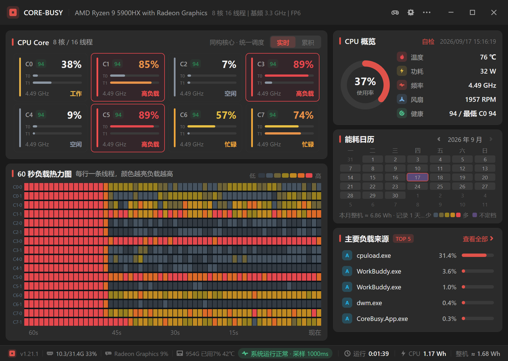
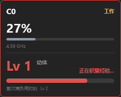

# CORE-BUSY 核忙

> 看看你的 CPU：谁在爆肝，谁在摸鱼，谁在偷偷升级。

把逐核 CPU 监视做成养成游戏：背景是一块 PCB 主板，每颗物理核是焊在上面的一颗芯片。
负载就是喂食——核越忙经验越多，攒够就升级、进化。



## 玩法

| 功能 | 说明 |
| --- | --- |
| 芯片角色卡 | 每核一颗芯片：等级大字 + 成长阶段（幼体 → 成长期 → 成熟期 → 究极期 → 满级传说）+ 性格角色 + EXP 进度 |
| 喂食 = 负载 | 占用率 / 频率 / SMT 线程明细在卡下半部；实时 / 累积两种口径 |
| 经验动画 | 点芯片弹出角色卡：EXP 条平滑生长，右下角直接给出「距升级约 X」的预估 |
| 性格角色 | 摸鱼 / 闲时热手 / 稳态 / 苦劳 / 尖峰 / 夜猫，按负载形状与昼夜分布判定 |
| 阶段变色 | 封装边框随成长阶段逐级点亮（品牌主题色），满级金色；高负载红框优先 |
| 状态栏 | 显卡 → 内存 → 硬盘 │ 累计运行时间（悬浮看本次 / 上次）│ 累计整机能耗（估算，带 ≈） |
| 常驻与省电 | 托盘常驻；性能模式；主题跟随 CPU 厂商；设置内一键开机启动 |

点击芯片弹出的角色卡（EXP 动画条 + 「距升级约 X」预估）：



**经验口径**：占用 ≥ 15% 按负荷积分，5%~15% 陪伴兜底（×0.15），< 5% 摸鱼不给经验。
等级 1–99，账本落盘跨进程延续；等级只表示「这颗核陪你跑了多久」。

## 下载与运行

从 [Releases](https://github.com/FiveDayZ/core-busy/releases) 下载 `CoreBusy-v{版本}-win-x64.zip`，
解压双击 `CoreBusy.App.exe` —— 单文件自包含，无需安装 .NET 运行时。

> 管理员身份运行才能读温度 / 功耗 / 风扇；读不到就是 `-`，绝不拿 0 冒充。

## 数据与配置

数据在 `%APPDATA%\CORE-BUSY\`（标题栏「更多」按钮可直达）：
`core-exp.json`（经验）· `core-roles.json`（角色）· `runtime.json`（运行时长）·
`energy-history.json`（能耗账本）· `settings.json`（配置，含整机能耗分项系数）。

无 UI 的调试环境变量：`COREBUSY_MOCK_CPU`（模拟拓扑）、`COREBUSY_FORCE_BRAND`（锁品牌主题）、
`COREBUSY_CORE_VIEW=cumulative`（累积视图启动）、`COREBUSY_DATA_DIR`（重定向数据目录）。

## 构建

```bash
python scripts/setup-dotnet-sdk.py   # 恢复 .NET SDK 8.0.425
python scripts/build-release.py      # 构建 → 单文件发布 → 打包
python scripts/lint_ui.py            # XAML 结构 + 绑定静态检查
```

发布产物见 `dist/`：full（自包含，约 159 MB）/ lite（4.9 MB，需系统 .NET 8 桌面运行时）。
EXP 曲线推导见 [docs/EXP-DESIGN.md](docs/EXP-DESIGN.md)。
